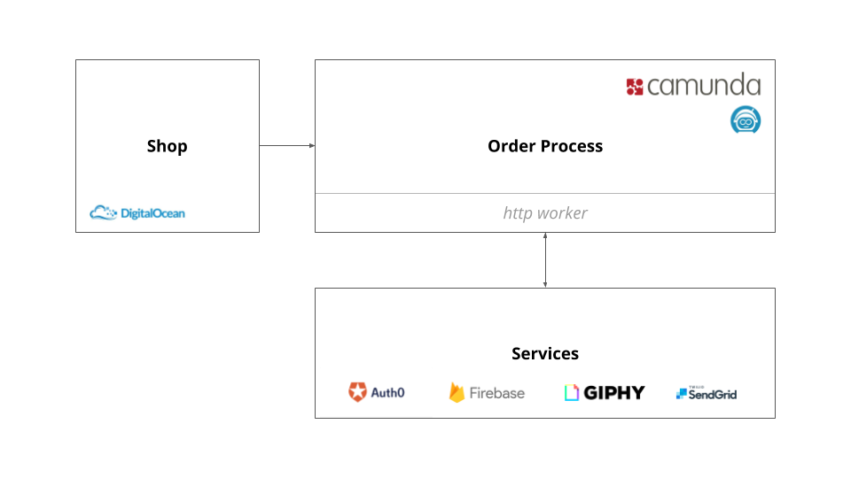
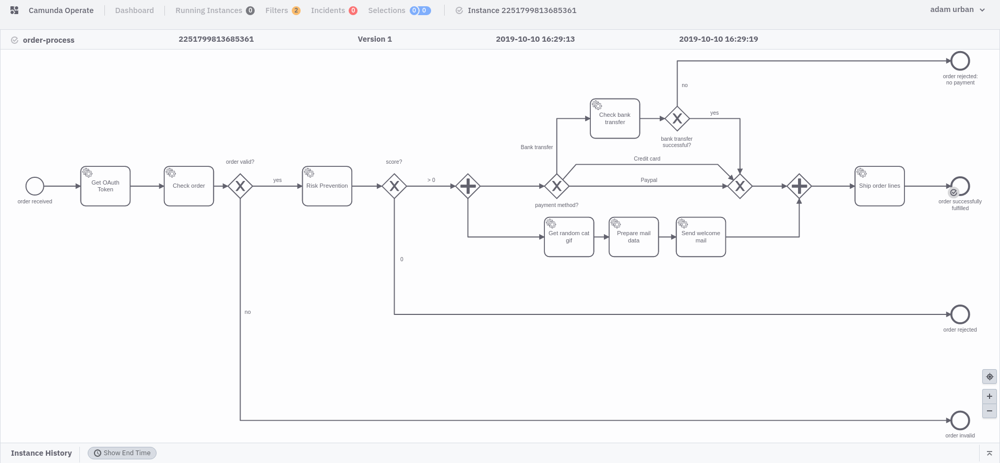

# Order process with zeebe and Camunda Cloud

So you want to play with Zeebe? I have a very good use case for it from my point of view. And exactly for this reason this project was born. In September 2019 Camunda Cloud was presented at the CamundaCon. This makes the execution of processes even easier, because the engine is now offered as a SaaS. If you want to learn more about this, I recommend the following readings:

- Mike [introduces Camunda Cloud](https://zeebe.io/blog/2019/09/announcing-camunda-cloud/)
- Bernd Rücker as one of the founders gives [a first impression of the offer.](https://blog.bernd-ruecker.com/camunda-cloud-the-why-the-what-and-the-how-8198f0a8c33b)
- A [Getting Started](https://zeebe.io/blog/2019/09/getting-started-camunda-cloud/) by Josh

## No hurdle to get started

From my own experience I know what it means to build order processes. Executable workflows offer two major advantages: software is no longer written exclusively with code, and the notation serves documentation that business people can easily understand. However, in the past we always had to take care of much more than just our own business logic - but with the rise of more and more SaaS offerings, the cloud and the serverless approach we finally have more time to deal with the actual issues.

Here I would like to show how easy it is to model, deploy and execute a workflows (that is admittedly very simple). Services are orchestrated that are provisioned as serverless functions on Google Firebase and other services like the Giphy API and the Sendgrid API for sending emails. The serverless functions are secured by OAuth tokens that are received during process execution.

A really very simple shop application starts an order process for a logged-in user. I've tried to use only services that have a free tier, so you can easily run the examples yourself. Of course you are free to fork and make your own customizations ;)

In summary, you need an account for the following services:

- CamundaCloud
- Auth0
- Google Firebase
- Giphy (optional)
- SendGrid (optional)
- DigitalOcean (optional)



Enough writing. Let's hack!

## Some insights

### The order process

The order process consists of a few nodes, a few gateways, and a few end nodes, each of which indicates the reason for the completion. Zeebe workflows are modeled with the Zeebe Modeler. So far it has only been usable as a standalone desktop application:



As already mentioned, it is a very simple workflow, but it should clarify how the Zeebe Engine can be used as SaaS:

- At the beginning, a token is requested for the process, which is then passed as JSON web tokens to the Firebase functions for authentication in the following steps.
- The CamundaCloud comes with a ready-to-use http worker so that service calls can be configured very easily. Necessary parameters, so-called worker variables, can be configured in the Cloud Console, which can be set in Service Tasks in the form `${variableName}`. This can be seen in any node.
- Unfortunately process variables cannot be set as header information of an http call until now. For this reason the token is not passed in the header but in the body.
- Parallel paths are possible, to see when checking the payment data and sending the welcome mail.

### Preparation in the Cloud Console

Before you can start deploying a process or starting an instance you need a cluster. Login to the console and create a new cluster.

#### Worker variables

Create the following worker variables, which will later be processed by the workers:

- `firebase-base-url`: you get the base URL from the Firebase Dashboard and will look like this: `https://us-central1-${firebase-project}.cloudfunctions.net/app`.
- `giphy-api-key`: with the API key the process can search for a random gif via the Gipy API
- `sendgrid-api-key`: Prerequisite for sending e-mails via SendGrid.
- `auth-url`: OAuth URL, via which the process can request a token: `https://[project].auth0.com/oauth/token`.

#### Create client

In order to interact with the Zeebe Broken from the outside, a client needs a valid token. The token is issued with valid client credentials. All you have to do is create a client in the console.

#### Auth0, Firebase, SendGrid, Giphy

These services are used in this use case (after all, we want to take care of our business logic and not build a core competency on issues like identity or emailing):

- Auth0: Identity provider for the shop and the order processes. Create an account and two applications: a single page application and a machine-2-machine application.
- Firebase: Compute Infrastructure - create a Functions project.
- SendGrid: E-Mail Service - Create account and create an API-Key.
- Giphy: Gif Database - Register and Get API Key for REST-API

#### Environment variables

The following environment variables contain info that doesn't belong in the repo, but our setup needs it to work (OPZ here stands for **o**rder-**p**rocess-**z**eebe):

- `OPZ_CLIENT_ID`: OAuth Client ID of the M2M Application (Auth0)
- `OPZ_CLIENT_SECRET`: OAuth Client Secret of the M2M Application (Auth0)
- `OPZ_AUDIENCE`: OAuth Audience of the M2M Application (Auth0)
- `CC_CLUSTER_UUID`: Cluster UUID (Camunda Cloud Console)
- `CC_BASE_URL`: Base URL for zeebe (Camunda Cloud Console) - `zeebe.camunda.io`
- `CC_CLIENT_ID`: Client ID (Camunda Cloud Console)
- `CC_CLIENT_SECRET`: Client Secret (Camunda Cloud Console)
- `CC_AUTH_URL`: OAuth URL to request client tokens - `https://login.cloud.camunda.io/oauth/token`


So you wanna implement an order process? Your welcome!

## Intro

This is one of the first introductions to Camunda Cloud which was announced some weeks ago. With this project I want to show you how you can integrate with Camunda Cloud. Topics like orchestrating microservices especially Google Firebase Functions are described in this project to show you how an orchestration could look like.

But before we start I would like to recommend some readings:

- Mike announces [Camunda Cloud](https://zeebe.io/blog/2019/09/announcing-camunda-cloud/): he is the product manager of the core product: zeebe - let him know what you're missing.
- Bernd Rücker is one of the founders of Camunda. He explains [the advantages of cloud and the trend of a microservice implementaton](https://blog.bernd-ruecker.com/camunda-cloud-the-why-the-what-and-the-how-8198f0a8c33b)
- Josh: In my career I never met someone like Josh, in a very positive way. Get started with the camuna cloud by reading his blog [post](https://zeebe.io/blog/2019/09/getting-started-camunda-cloud/)

## Motivation

Via the intro I've already introduced some very cool readings about Camunda Cloud. Someone could ask: why another project to learn about BPMN or especially a BPMN cloud solution. From my point of view the answer is very easy: In my career I've also build order processes. I know the pain the difficulties introducing it. Well, to be honest, with Camunda Cloud it's straight forward. Let me show you with this project.

Let me show you how to secure serice request with standard JSON web tokens, orchestrate services with a BPMN process and of course send a welcome mail as introducton ;)

To get started with this project make sure you have the following accounts:

- Google Account for your Firebase project
- Sendgrid Account to send mails without maintaining a mai service
- Giphy API accunt to search for appropriate gifs for you.
- Cloud environment like AWS or Digital Ocean to deploy the shop frontend.

order process with zeebe, serverless orchestration, free tier, service authentication

## Preconditions to run this demo

- Camunda Cloud account to run workflow instances in the cloud
  - apply here: https://zeebe.io/cloud/
  - login here: https://camunda.io
- Firebase account to deploy and execute Google Functions
  - login here with your google account: https://firebase.google.com
- Giphy account and API key to search for Gifs
  - not really mandatory, but nice to search a gif
- SendGrid account to send mails
  - not mandatory, but cool to send a welcome mail from our order process

## Setup

Configure the following worker variables:

- firebase-base-url: this is the base url your firebase functions are deployed
- giphy-api-key
- sendgrid-api-key
- auth-url: oauth url from auth0

Configure auth stuff:

- auth0 m2m api and application
  - client infos into env vars: `OPZ_CLIENT_ID`, `OPZ_CLIENT_SECRET`, `OPZ_AUDIENCE`
  - symmetric secret into firebase env vars:

```bash
firebase functions:config:set auth.secret="xxx"
```

Set env vars:

- `OPZ_CLIENT_ID`: oauth client id of m2m app in auth0
- `OPZ_CLIENT_SECRET`: oauth client secret of m2m app in auth0
- `OPZ_AUDIENCE`: audience of m2m app in auth0
- `CC_CLUSTER_UUID`: cluster uuid in camunda cloud
- `CC_BASE_URL`: base url to connect to camunda cloud
- `CC_CLIENT_ID`: created client id of camunda cloud cluster
- `CC_CLIENT_SECRET`: corresponding secret of client
- `CC_AUTH_URL`: oauth url to get access tokens

shop deployed on digital ocean: http://139.59.157.127:8080/
