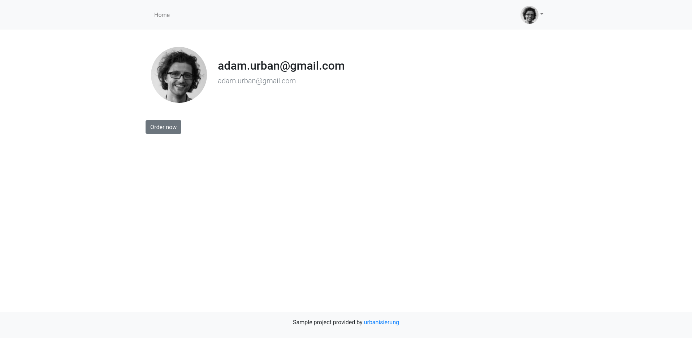

# Order process with zeebe and Camunda Cloud

So you want to play with Zeebe? I have a very good use case for it from my point of view. And exactly for this reason this project was born. In September 2019 Camunda Cloud was presented at the CamundaCon. This makes the execution of processes even easier, because the engine is now offered as a SaaS. If you want to learn more about this, I recommend the following readings:

- Mike [introduces Camunda Cloud](https://zeebe.io/blog/2019/09/announcing-camunda-cloud/)
- Bernd Rücker as one of the founders gives [a first impression of the offer.](https://blog.bernd-ruecker.com/camunda-cloud-the-why-the-what-and-the-how-8198f0a8c33b)
- A [Getting Started](https://zeebe.io/blog/2019/09/getting-started-camunda-cloud/) by Josh

## No hurdle to get started

From my own experience I know what it means to build order processes. Executable workflows offer two major advantages: software is no longer written exclusively with code, and the notation serves documentation that business people can easily understand. However, in the past we always had to take care of much more than just our own business logic - but with the rise of more and more SaaS offerings, the cloud and the serverless approach we finally have more time to deal with the actual issues.

Here I would like to show how easy it is to model, deploy and execute a workflows (that is admittedly very simple). Services are orchestrated that are provisioned as serverless functions on Google Firebase and other services like the Giphy API and the Sendgrid API for sending emails. The serverless functions are secured by OAuth tokens that are received during process execution.

A really very simple shop application starts an order process for a logged-in user. I've tried to use only services that have a free tier, so you can easily run the examples yourself. Of course you are free to fork and make your own customizations ;)

In summary, you need an account for the following services:

- CamundaCloud
- Auth0
- Google Firebase
- Giphy (optional)
- SendGrid (optional)
- DigitalOcean (optional)


Enough writing. Let's hack!

## Some insights and pre-conditions

### The order process

The order process consists of a few nodes, a few gateways, and a few end nodes, each of which indicates the reason for the completion. Zeebe workflows are modeled with the Zeebe Modeler. So far it has only been usable as a standalone desktop application:


As already mentioned, it is a very simple workflow, but it should clarify how the Zeebe Engine can be used as SaaS:

- At the beginning, a token is requested for the process, which is then passed as JSON web tokens to the Firebase functions for authentication in the following steps.
- The CamundaCloud comes with a ready-to-use http worker so that service calls can be configured very easily. Necessary parameters, so-called worker variables, can be configured in the Cloud Console, which can be set in Service Tasks in the form `${variableName}`. This can be seen in any node.
- Unfortunately process variables cannot be set as header information of an http call until now. For this reason the token is not passed in the header but in the body.
- Parallel paths are possible, to see when checking the payment data and sending the welcome mail.

### Preparation in the Cloud Console

Before you can start deploying a process or starting an instance you need a cluster. Login to the console and create a new cluster.

#### Worker variables

Create the following worker variables, which will later be processed by the workers:

- `firebase-base-url`: you get the base URL from the Firebase Dashboard and will look like this: `https://us-central1-${firebase-project}.cloudfunctions.net/app`.
- `giphy-api-key`: with the API key we can uses services to search for a random gif via the Giphy API
- `sendgrid-api-key`: Prerequisite for sending e-mails via SendGrid.
- `auth-url`: OAuth URL, via which the process can request a token: `https://[project].auth0.com/oauth/token`.


#### Create client

In order to interact with the Zeebe broker from the outside, a client needs a valid token. The token is issued with valid client credentials. All you have to do is create a client in the console.


### Auth0, Firebase, SendGrid, Giphy

These services are used in this use case (after all, we want to take care of our business logic and not build a core competency on issues like identity or emailing):

- Auth0: Identity provider for the shop and the order processes. Create an account and two applications: a single page application and a machine-2-machine application.
- Firebase: Compute infrastructure - create a Functions project.
- SendGrid: E-mail service - create an account and an API-Key.
- Giphy: Gif Database - Register and get API Key for REST-API

### Environment variables

The following environment variables contain info that doesn't belong in the repo, but our setup needs it to work (OPZ here stands for **o**rder-**p**rocess-**z**eebe):

- `OPZ_CLIENT_ID`: OAuth Client ID of the M2M Application (Auth0)
- `OPZ_CLIENT_SECRET`: OAuth Client Secret of the M2M Application (Auth0)
- `OPZ_AUDIENCE`: OAuth Audience of the M2M Application (Auth0)
- `CC_CLUSTER_UUID`: Cluster UUID (Camunda Cloud Console)
- `CC_BASE_URL`: Base URL for zeebe (Camunda Cloud Console) - `zeebe.camunda.io`
- `CC_CLIENT_ID`: Client ID (Camunda Cloud Console)
- `CC_CLIENT_SECRET`: Client Secret (Camunda Cloud Console)
- `CC_AUTH_URL`: OAuth URL to request client tokens - `https://login.cloud.camunda.io/oauth/token`

## Let's deploy and start

### Deploy firebase functions

Go to:

```bash
cd functions
```

In Auth0 we have chosen a symmetric token encryption. So that our functions can check whether a token is valid, we have to make the corresponding secret known. For this we set an environment variable (`xxx` corresponds to `$OPZ_CLIENT_SECRET`):

```bash
firebase functions:config:set auth.secret="xxx"
```

Now deploy the functions:

```bash
npm run deploy
```

### Deploy order process

```bash
cd zeebe
npm install
npm run start
```

In Operate you should now see the deployed workflow:


### Start shop

```bash
cd shop
npm install
npm run start
```


The shop frontend is delivered on port `8080`. Log in, go to your profile and click **order**.



Then you can use the Cloud Console to jump to Operate and see your instance.

Alternatively you can find the frontend at [https://zeebe.adamurban.de:8080](https://zeebe.adamurban.de:8080) (if I haven't cleared it already).

Have fun!
